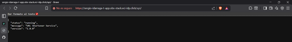

# Bitácora Experimento - Observabilidad y Monitoreo

**Nombre del estudiante:** _____________________________  
---
Cuando acabes no olvides ayudarnos evaluando tu ⭐[experiencia](https://forms.office.com/r/JCyhCpujrt)⭐
---

## Tabla de Contenidos
- [Etapa 1: Preparación del Ambiente](#etapa-1-preparación-del-ambiente)
- [Etapa 2: Métricas Iniciales](#etapa-2-métricas-iniciales)
- [Etapa 2.1: Dashboard Base en Grafana](#etapa-21-dashboard-base-en-grafana)
- [Etapa 2.2: Propuesta de Métrica Personalizada](#etapa-22-propuesta-de-métrica-personalizada)
- [Etapa 3: Experimentación y Análisis del Sistema](#etapa-3-experimentación-y-análisis-del-sistema)

---

## Etapa 1: Preparación del Ambiente

### 1.1. Información de la aplicación

### 1.2. Verificación del despliegue

**¿La aplicación se desplegó correctamente?** 

- [X] Sí
- [ ] No



**DOMINIO:** https://sergio-idarraga-t-app.obs-stack.eci-idp.click/api/


### 1.3. Observaciones y problemas encontrados (opcional)

La aplicación corrió sin problema, cuando se clono el repositorio solo se tuvo que instalar todas las dependencias.


## Etapa 2: Métricas Iniciales

### 2.0.1. Generación de tráfico

**Endpoints probados:**

- [X] `GET /api/`
- [X] `POST /api/shorten`
- [X] `GET /api/{shortCode}`
- [X] `GET /api/urls`


### 2.0.2. Análisis de dos métricas relevantes

#### Métrica 1

**Nombre de la métrica:** http_server_requests_seconds summary 

**Tipo de métrica:** 
- [ ] Counter
- [ ] Gauge 
- [ ] Histogram 
- [X] Summary

**Descripción de qué información aporta:**

**1** Esta métrica representa el tiempo en cual se tarde en realizar la petición HTTP. Se mide en segundos y permite analizar el comportamiento y rendimiento de cada endpoint de la aplicación.

**Relación con otras métricas (si aplica):**
```
Ejemplo: Un aumento en peticiones HTTP podría influir en el uso de CPU


```

**¿En que escenarios puede ayudar esta métrica?**
```


```

**¿Qué etiquetas (labels) se utilizan para agrupar los datos?**
```
Ejemplo: uri, method, status, instance, job, etc.


```

---

#### Métrica 2

**Nombre de la métrica:** http_server_requests_seconds_max gauge

Esta métrica indica el mayor tiempo de respuesta registrado para una solicitud HTTP en un endpoint específico.
A diferencia de la métrica anterior, que muestra datos acumulados, esta representa la latencia máxima observada.
**Tipo de métrica:** 
- [ ] Counter
- [X] Gauge 
- [ ] Histogram 
- [ ] Summary

**Descripción de qué información aporta:**
```


```

**Relación con otras métricas (si aplica):**
```
Ejemplo: Un aumento en peticiones HTTP podría influir en el uso de CPU


```

**¿En que escenarios puede ayudar esta métrica?**
```


```

**¿Qué etiquetas (labels) se utilizan para agrupar los datos?**
```
Ejemplo: uri, method, status, instance, job, etc.


```

---

## Etapa 2.1: Dashboard Base en Grafana


### 2.1.1. Evidencia: Dashboard Base en Grafana con los 4 paneles iniciales

**Captura de pantalla del dashboard:**

> _[Inserta aquí la imagen del dashboard con los 4 paneles]_

### 2.1.2. Visualizaciónes Adicionales (Con las metricas actuales)

#### Visualización Adicional 1

**Propósito:**
```
¿Qué quieres analizar o mostrar? Menciona qué métrica(s) vas a usar


```

**Título del panel:**
```

```

**Consulta (PromQL o LogQL):**
```
Consejo: Si usaste la interfaz de Grafana para crear el panel, puedes copiar la consulta que se muestra en la caja de texto de la seccion Code.

```

**Tipo de visualización:** 
- [ ] Time series
- [ ] Gauge
- [ ] Bar chart
- [ ] Stat
- [ ] Logs
- [ ] Otro: _____

**Otros ajustes aplicados (colores, unidades, etc.) (opcional):**
```


```

**Captura de pantalla:**

> _[Inserta aquí la imagen del panel]_

**Análisis (2-3 frases):**
```
¿Qué conclusiones o patrones observas?


```

---

#### Visualización Adicional 2

**Propósito:**
```
¿Qué quieres analizar o mostrar? Menciona qué métrica(s) vas a mostrar


```

**Título del panel:**
```

```

**Consulta (PromQL o LogQL):**
```
Consejo: Si usaste la interfaz de Grafana para crear el panel, puedes copiar la consulta que se muestra en la caja de texto de la seccion Code.

```

**Tipo de visualización:** 
- [ ] Time series
- [ ] Gauge
- [ ] Bar chart
- [ ] Stat
- [ ] Logs
- [ ] Otro: _____

**Otros ajustes aplicados (colores, unidades, etc.) (opcional):**
```


```

**Captura de pantalla:**

> _[Inserta aquí la imagen del panel]_

**Análisis (2-3 frases):**
```
¿Qué conclusiones o patrones observas?


```

---

### 2.1.3. Análisis final del dashboard

**¿Qué otros datos te gustaría visualizar si tuvieras más información disponible?**
```


```

---

## Etapa 2.2: Propuesta de Métrica Personalizada


### Análisis y propuesta de la métrica propia (en Java)

**1. Nombre de la métrica:**
```
Ejemplo: url_shortener_urls_created_total

```

**2. Tipo de métrica:**
- [ ] Counter
- [ ] Gauge

**3. ¿Qué comportamiento mide?**
```


```

**4. ¿Por qué es relevante para el sistema?**
```


```


---

### Visualización en Grafana


**1. ¿Qué tipo de panel usaste en Grafana?**

- [ ] Time series  
- [X] Gauge  
- [ ] Stat  
- [ ] Bar chart  
- [ ] Otro: _____

**2. ¿Qué consulta PromQL vas a utilizar?**
```promql
Latencia máxima por URI y método (en segundos)
max by (uri, method) (
  http_server_requests_seconds_max{applicationName="sergio-idarraga-t-app-monitoring"}
)


Tasa de peticiones por segundo por URI y método
sum by (uri, method) (
  rate(http_server_requests_seconds_count{applicationName="sergio-idarraga-t-app-monitoring"}[1m])
)


```

**3. ¿Cuál es el propósito de la visualización?**
```
El panel busca mostrar la latencia observada por endpoint (URI) y método, poniendo énfasis en la latencia máxima registrada para identificar los casos más lentos que afectan la experiencia del usuario. La métrica de tasa de peticiones (requests/s) se muestra junto a la latencia para correlacionar aumentos de tráfico con posibles degradaciones del rendimiento. Esto facilita la detección rápida de endpoints que requieren optimización o que presentan picos de latencia bajo carga, y sirve como entrada para definir umbrales y alertas (por ejemplo: latencia máxima > 1.0s sostenida). Se recomienda usar segundos como unidad y mostrar el endpoint peor (topk(1)) en un Gauge, y la tasa/latencia promedio en un Time series para análisis temporal.
```

---

<div align="center">
  
</div>

<div align="center">
  
</div>

## Etapa 3: Experimentación y Análisis del Sistema

En esta sección documenta las pruebas de carga, escenarios ejecutados, resultados observados y conclusiones. Incluye gráficos, tablas y observaciones relevantes sobre cómo el sistema respondió bajo diferentes patrones de tráfico.

